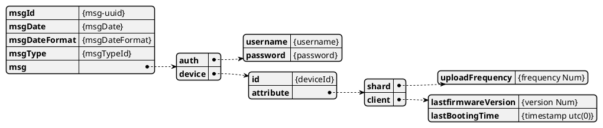
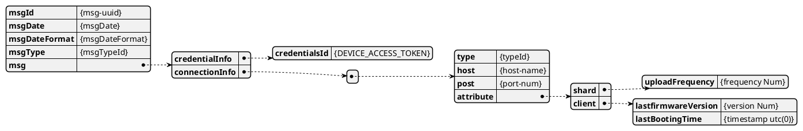

# Rest API - Airdeep.DeviceRegister 

## 선행 조건
  - 없음
## **Protocol**
- HTTP
## **Host Name**
- **개발기 : https://dev-api-airdeep.rtdata.co.kr**
- **상용기 : https://api-airdeep.rtdata.co.kr**

## **Resource Path**
- **/v1/devices/register**

## **Query Parameter**
  ```json
    없음
  ```
  
## **HTTP Request Headers**
  ```json
    "Content-Type": "application/json",
    "Accept": "*/*"
  ```
## **Request Method**
  ```json
    POST
  ```

## **Request Body**
  ```json
   {
      'msgId': '[MESSAGE-UUID]',
      'msgDate': '2020-11-11 14:54:05+0900',
      'msgDateFormat': 'yyyy-MM-dd HH:mm:ssZ',
      'msgType': 100
      'msg': {
          'auth' : {'username': 'username',
                    'password': 'password'},
          'device': {
              'id': 'device name',
              'attribute': {
                  'shared': { 'uploadFrequency': 2  },
                  'client': { 'lastFirmwareVersion': 1001,
                  'lastBootingTime' : timestamp(utc0) }
              }
          }
       }
   }
  ```

* **Request Body 설명**
  Name | Type | Description | Notes
  ------------ | ------------- | ------------- | -------------
  **msgId** | **str**| 메시지 구분을 위한 ID, 응답으로 이 값을 전달한다. | 
  **msgDate** | **str**| msgDateFormat 에 따른 메시지 생성 시간 | 
  **msgDateFormat** | **str**| msgDate 의 형식을 나타낸다. | 
  **msgType** | **str**| msg 에 포함된 데이터 타입을 나타낸다. | 
  **msg** | **str**| msgType 에 따른 데이터 값. | 
  **msg.auth** | **str**| 계정 정보  |  
  **msg.device** | **str**| device 정보 | 
  **msg.device.id** | **str**| deivce의 uuid | 
  **msg.device.attribute** | **str**| 서버에 저장될 속성 정보 | 
  **msg.device.shared** | **int**| server, client 공유 속성 정보 | 
  **msg.device.client** | **str**| client 속성 정보 | 


</br>

* **Attribute 설정 정보**
  | 설정키 | 목적 | 공용(서버/장비) | 장비 | 
  |:-----|:----|:----:|:----:|
  | uploadFrequency | 데이터 업로드 주기를 설정한다.| O | O |
  | lastFirmwareVersion | 장비의 현재 펌웨어 버전을 기록한다. | X | O |
  | lastBootingTime | 마지막 구동 시간을 기록한다. | X | O |
</br>

## **Response body**
  ```json
  {
      'msgId': '[MESSAGE-UUID]',
      'msgDate': '2020-11-11 14:54:05+0900',
      'msgDateFormat': 'yyyy-MM-dd HH:mm:ssZ',
      'msgType': 201
      'msg': {
         'credentialInfo': {
            'credentialsId': '[DEVICE_ACCESS_TOKEN]'
          },
          'connectionInfo': [{
              'type': 'mqtt' ,
              'host': 'mqtt-airdeep.rtdata.co.kr'
              'port' : 8843
           }, { 'type': '...', ...}]
      }
  }
  ```
</br>

* **Response body 설명**
  Name | Type | Description | Notes
  ------------ | ------------- | ------------- | -------------
  **msgId** | **str**| 메시지 구분을 위한 ID, 응답으로 이 값을 전달한다. | 
  **msgDate** | **str**| msgDateFormat 에 따른 메시지 생성 시간 | 
  **msgDateFormat** | **str**| msgDate 의 형식을 나타낸다. | 
  **msgType** | **str**| msg 에 포함된 데이터 타입을 나타낸다. | 
  **msg** | **str**| msgType 에 따른 데이터 값. | 
  **msg.credentialInfo** | **str**| Access token 값  |  
  **msg.connectionInfo** | **str**| MQTT 접속 정보 (향 후 MQTT 외 추가 될 수 있음) | 

## **Python Example(업데이트 예정)**
```python
import requests
import json
from datetime import datetime

HOST = "https://api.airdeep.rtdata.co.kr/v1/device/register"
credentialsId = ""
sharedKeys = "sharedKeys=uploadFrequency" # shared 또는 client 필요한 속성을 조회 함, 여기서는 uploadFrequency 만 조회 함

headers = {
            "content-type":"application/json"
        }
response = requests.request("POST", ... , headers=headers)
print(response.json())
```

</br>

## *Appendix. json contens 도식화*

* Request Contents




* Response Contents


