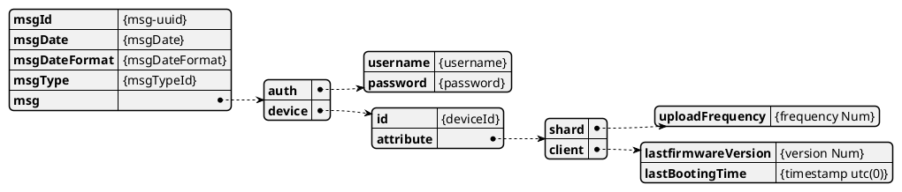
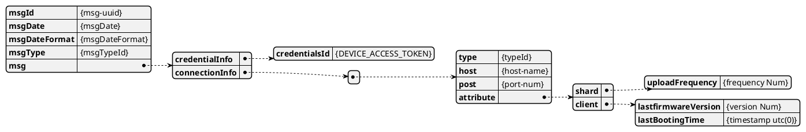

# Rest API - Airdeep.DeviceRegister 

## **선행 조건**
  - 없음
## **Protocol**
- HTTP / TLS
## **Host Name**
- **개발기 : https://dev-api-airdeep.rtdata.co.kr**
- **상용기 : https://api-airdeep.rtdata.co.kr**


## **Request Method**
  ```json
    POST
  ```

## **Request Headers**
  ```json
    "Content-Type": "application/json",
  ```

## **Resource Path**
  ```json
    /v1/devices/register
  ```


## **Query Parameter**
  ```json
    없음
  ```

## **Request Body**
  ```json
   {
      'msgId': '[MESSAGE-UUID]',
      'msgDate': '2020-11-11 14:54:05+0900',
      'msgDateFormat': 'yyyy-MM-dd HH:mm:ssZ',
      'msgType': 1100
      'msg': {
          'auth' : {'username': 'username',
                    'password': 'password'},
          'device': {
              'id': 'device name',
              'attribute': {
                  'shared': { 'uploadFrequency': 2  },
                  'client': { 'lastFirmwareVersion': 1001,
                  'lastBootingTime' : timestamp }
              }
          }
       }
   }
  ```

* **Request Body 설명**
  Name | Type | Description | Notes
  ------------ | ------------- | ------------- | -------------
  **msgId** | **String**| 메시지 구분을 위한 ID, 응답으로 이 값을 전달한다. | 
  **msgDate** | **String**| msgDateFormat 에 따른 메시지 생성 시간 | 
  **msgDateFormat** | **String**| msgDate 의 형식을 나타낸다. | 
  **msgType** | **String**| msg 에 포함된 데이터 타입을 나타낸다. | 
  **msg** | **String**| msgType 에 따른 데이터 값. | 
  **msg.auth** | **String**| 계정 정보  |  
  **msg.device** | **String**| device 정보 | 
  **msg.device.id** | **String**| deivce의 uuid | 
  **msg.device.attribute** | **String**| 서버에 저장될 속성 정보 | 
  **msg.device.attribute.shared** | **Number**| server, client 공유 속성 정보 |
  **msg.device.attribute.shared.uploadFrequency** | **Number**| 센서 데이터 주기 (초) |
  **msg.device.attribute.client** | **String**| client 속성 정보 | 
  **msg.device.attribute.client.lastFirmwareVersion** | **String**| 단말의 펌웨어 버전 | 
  **msg.device.attribute.client.lastBootingTime** | **String**| 단말의  부팅 시간 (Unix Timestamp, Sec) | 

</br>


* **Attribute 설정 정보**
  | 설정키 | 목적 | 공용(서버/장비) | 장비 | 
  |:-----|:----|:----:|:----:|
  | uploadFrequency | 데이터 업로드 주기를 설정한다.| O | O |
  | lastFirmwareVersion | 장비의 현재 펌웨어 버전을 기록한다. | X | O |
  | lastBootingTime | 마지막 구동 시간을 기록한다. | X | O |
</br>


## **CURL 예시**
  ```
curl --location --request POST 'https://dev-api-airdeep.rtdata.co.kr/v1/devices/register' \
--header 'Content-Type: application/json' \
--data-raw ' {
    "msgId": "UUID-12345",
    "msgDate": "2021-01-26 14:54:05+0000",
    "msgDateFormat": "yyyy-MM-dd HH:mm:ssZ",
    "msgType": 1100,
    "msg": {
        "auth" : {"username": "cj.lee@mobideep.co.kr",
                  "password": "123456789"},
        "device": {
            "id": "device-id",
            "attribute": {
                "shared": { "uploadFrequency": 2  },
                "client": { "lastFirmwareVersion": 1001,
                "lastBootingTime" : 123456 }
            }
        }
     }
 }'
  ```


## **Response body**
  ```json
  {
      'msgId': '[MESSAGE-UUID]',
      'msgDate': '2020-11-11 14:54:05+0900',
      'msgDateFormat': 'yyyy-MM-dd HH:mm:ssZ',
      'msgType': 1150
      'msg': {
         'credentialInfo': {
            'credentialsId': '[DEVICE_ACCESS_TOKEN]'
          },
          'connectionInfo': [{
              'type': 'mqtt' ,
              'host': 'mqtt-airdeep.rtdata.co.kr'
              'port' : 8843
           }, { 'type': '...', ...}]
      }
  }
  ```
</br>

* **Response body 설명**
  Name | Type | Description | Notes
  ------------ | ------------- | ------------- | -------------
  **msgId** | **String**| 메시지 구분을 위한 ID, 응답으로 이 값을 전달한다. | 
  **msgDate** | **String**| msgDateFormat 에 따른 메시지 생성 시간 | 
  **msgDateFormat** | **String**| msgDate 의 형식을 나타낸다. | 
  **msgType** | **Number**| msg 에 포함된 데이터 타입을 나타낸다. | 
  **msg** | **String**| msgType 에 따른 데이터 값. | 
  **msg.credentialInfo** | **String**| Access token 값  |  
  **msg.connectionInfo** | **String**| MQTT 접속 정보 (향 후 MQTT 외 추가 될 수 있음) | 


* **msgType 설명**
  - json 의 msg 필드가 어떠한 형식의 값인지 나타낸다.

     msgType | Type | Description 
     ------------ | ------------- | -------------
     **1100** | **Number**| (Rquest) device 등록 시도를 하기 위한 값을 나타낸다.
     **1150** | **Number**| (Response) device 등록이 정상 처리 되어 디바이스가 필요한 정보를 나타낸다.
     **400** | **Number**| (Rquest) 파라미터 유효성 검사 중 에러
     **404** | **Number**| (Rquest) 서버 로그인 실패
     **500** | **Number**| (Rquest) 서버 내부 로직등의 예외적인 에러

## **Python Example(업데이트 예정)**
```python
import requests
import json
from datetime import datetime

HOST = "https://api.airdeep.rtdata.co.kr/v1/device/register"
credentialsId = ""
sharedKeys = "sharedKeys=uploadFrequency" # shared 또는 client 필요한 속성을 조회 함, 여기서는 uploadFrequency 만 조회 함

headers = {
            "content-type":"application/json"
        }
response = requests.request("POST", ... , headers=headers)
print(response.json())
```


# *Appendix A. HTTP STATUS CODE 정의*
  | HTTP STATUS CODE | 설명 |
  |:-----------------|:-----|
  |200(OK)| 정상적으로 처리 |
  |400(Bad Request)| 파라미터 유효성 검사 중 에러 |
  |401(Unauthorized)| API 인증 실패 |
  |403(Forbidden)| API 접근 권한 오류 |
  |404(Not Found)| 요청 API 가 존재하지 않거나 사용자가 경우 (리소스가 없는 경우) |
  |500(Internal Server Error)|서버 내부 로직등의 예외적인 에러 |
  |503(Service Unavailable)|서버 유지보수, 과부하등으로 요청 처리를 할 수 없는 경우|
  |504(Gateway Timeout)| 요청 후 응답 Timeout 이 발생한 경우|
  
  <br>


* A1.1 성공 응답 Body
  ```
  요청에 대하여 성공인 경우는 HTTP Status code를 200(성공), 응답 Body 값은 각 각의 API 에서 정의된 값으로 반환한다.
  ```

* 실패 응답 Body
  ```
  실패인 경우 HTTP Status Code 값을 4xx, 5xx 반환하며, 응답 Body 값은 각 각의 API 에서 정의된 값으로 반환한다. (응답 Body에 정의된 msgType 값을 통하여 상세 에러내역을 확인할 수 있다)
  ```

</br>

# *Appendix B. JSon Contents 도식화*


* Request Contents




* Response Contents




