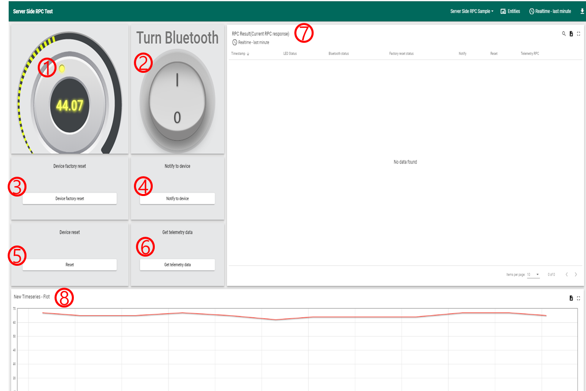

# MQTT API - Airdeep.RpcCommand

## **목적**
  - 디바이스는 서버로 부터 수신 된 제어 명령어를 처리하고, 처리 결과를 서버에 전달한다.

## **선행 조건**
  - 장치 등록 
  - 디바이스 등록 과정에서 수신받은 MQTT 호스트 정보
  - Access Token (deviceCredentialsId)

</br>

## **Protocol**
- MQTT

</br>

## **Host Name**
- [디바이스 등록 과정](./HTTP-API-DeviceRegister.md)에서 수신받은 MQTT 호스트 정보

</br>

## **MQTT TOPIC**
NO | TOPIC    | Publish | Subscribe | Description
:------: | :------ | :---------: | :----------: | :----------
1  | v1/devices/me/rpc/request/+  | X | O | **Subscribe** </br> 서버로부터 제어 명령어를 받아 처리한다.
2 | v1/devices/me/telemetry | O | X | **Publish** </br> 제어 결과를 전달한다.
3 | v1/devices/me/rpc/response | O | X | **Publish** </br> 제어 결과를 전달한다.

</br>

## **Payload** - 제어명령
NO | TOPIC    | Send(Publish) | Recv(on_message) | Response
:------: | :------ | :---------: | :----------| :----------
1  | v1/devices/me/rpc/request/+  | X | {"method":"getLEDValue"} | {"LEDValue": 10}
2 | v1/devices/me/rpc/request/+ | X | {"method":"setLEDValue","params":71} | {"LEDValue": params}
3 | v1/devices/me/rpc/request/+ | X | {"method":"factoryReset","params":"{}"} | {"factoryReset": "true"}
4 | v1/devices/me/rpc/request/+ | X | {"method":"reset","params":"{}"} | {"reset": "true"}
5 | v1/devices/me/rpc/request/+ | X | {"method":"notify","params":"{1}"} | {"notify": params}
6 | v1/devices/me/rpc/request/+ | X | {"method":"turnBT","params":true} | {"turnBlutooth": params}
7 | v1/devices/me/rpc/request/+ | X | {"method":"checkUpdate","params":"{}"} | {"checkUpdate": {}}
8 | v1/devices/me/rpc/request/+ | X | {"method":"getTelemetry","params":"{}"} | {"getTelemetry": { 'temperature': 0, 'temperature_max': 0,'temperature_unit':'C', 'humidity': 0, 'humidity_max': 0, 'humidity_unit': "%", 'co2': 0, 'co2_max': 0, 'co2_unit': "ppm", 'pm10': 0, 'pm10_max': 0, 'pm10_unit': "µg/m3", 'pm2.5': 0, 'pm2.5_max': 0, 'pm2.5_unit': "µg/m3",  'tvoc': 0, 'tvoc_max': 0, 'tvoc_unit': "mg/m3", 'report_reason': 'Report Reason' }}

</br>


## **Payload 설명**
Key        |  Value | Description | Param
:----------|:-----------------|:------------------|:------------------
method| getLEDValue | LED 밝기 조절 정보요청 |
method| setLEDValue | LED 밝기 조절 명령 | 0 ~ 100
method| factoryReset | 공장초기화 | 없음
method| reset | 리셋 | 없음
method| notify | 알람 | 0 ~ 3
method| turnBT | BT 기능 | true, false
method| checkUpdate | Check update | 없음
method| getTelemetry | Aircondition report | 없음

</br></br>

## **시퀀스 다이어그램**

1. RPC 명령
    - 디바이스를 제어한다.
   ```plantuml
   @startuml
     participant "AirDeep[AQS]" order 1
     participant "AirDeep[MQTT Server]" order 2
     hide footbox

     group 1. MQTT - Connection
      "AirDeep[AQS]" -> "AirDeep[MQTT Server]" : MQTT Connection(MQTT_HOST, MQTT_PORT, ACCESS_TOKEN(deviceCredentialsId))
      "AirDeep[AQS]" <- "AirDeep[MQTT Server]"  : Ack(Connected)
     end

     == MQTT Session Established ==
     group 2. MQTT - Subscribe - RPC Topic
     "AirDeep[AQS]" -> "AirDeep[MQTT Server]" : 1.1) Subscribe  - RPC_REQUEST_TOPIC


     group 2. MQTT - 디바이스 제어
     "AirDeep[AQS]" <- "AirDeep[MQTT Server]" : 2.1) Publish - TOPIC Starts With (RPC_REQUEST_TOPIC)
     "AirDeep[AQS]" <- "AirDeep[AQS]" : 1.3) on_message
     note left: method keys\n -getLEDValue\n -setLEDValue\n -factoryReset\n -reset\n -notify\n -turnBT\n -getTelemetry

        group 3. MQTT - Publish - RCP 결과를 전달한다.
        "AirDeep[AQS]" -> "AirDeep[MQTT Server]" : 2.2) Publish - 제어 결과를 전달한다. (TELEMETRY_TOPIC)
        note left: method keys\n -setLEDValue\n -factoryReset\n -reset\n -notify\n -turnBT\n -getTelemetry
        
        "AirDeep[AQS]" -> "AirDeep[MQTT Server]" : 2.3) Publish - 제어 결과를 전달한다. (RPC_RESPONSE_TOPIC + ID)
        note left: method key\n -getLEDValue
        end
     end

     group 3. MQTT - Upload Telemetry Data
       "AirDeep[AQS]" -> "AirDeep[MQTT Server]" : 3.1) Publish Data - (TELEMETRY_TOPIC) 
     end
     
     == MQTT Session Established ==
   @enduml
   ```
</br></br>

 
## **Python Example**

```python
TELEMETRY_TOPIC ="v1/devices/me/telemetry"
RPC_REQUEST_TOPIC ="v1/devices/me/rpc/request/+"
RPC_RESPONSE_TOPIC ="v1/devices/me/rpc/response/"

sensor_data = {
    'ts' : 0,
    'temp': 0, 'temp_max': 0,'temp_unt':'C', 'temp_ts' : datetime.now().timestamp() * 1000,
    'hmd': 0, 'hmd_max': 0, 'hmd_unt': "%",'hmd_ts' : datetime.now().timestamp() * 1000,
    'co2': 0, 'co2_max': 0, 'co2_unt': "ppm",'co2_ts' : datetime.now().timestamp() * 1000,
    'pm10': 0, 'pm10_max': 0, 'pm10_unt': "µg/m3", 'pm10_ts' : datetime.now().timestamp() * 1000,
    'pm2.5': 0, 'pm2.5_max': 0, 'pm2.5_unt': "µg/m3", 'pm2.5_ts' : datetime.now().timestamp() * 1000,
    'tvoc': 0, 'tvoc_max': 0, 'tvoc_unt': "mg/m3",'tvoc_ts' : datetime.now().timestamp() * 1000,
    'report_rsn': 'Report Reason'
}
# When device is connected to AirDeep server
def on_connect(client, userdata, rc, *extra_params):

    # Subscribe rpc command from mobideep server to device
    client.subscribe(RPC_REQUEST_TOPIC)


def on_message(client, userdata, msg):
    
    global uploadFrequency

    payload = json.loads(msg.payload)

    # Serverside RCP Controller
    if msg.topic.startswith("v1/devices/me/rpc/request/"):
        # 'v1/devices/me/rpc/request/${id}' :  ${id} 값을 가져와 requestId에 할당한다.
        requestId = msg.topic[len("v1/devices/me/rpc/request/"):len(msg.topic)]
    
        # LED 밝기 조절 setLEDValue, getLEDValue (0~100) LED on 될때의 전체 밝기의 비율
        # 서버에서 특정값을 조회했을때 서버로 전송함
        if payload["method"] == "getLEDValue":

            #LED 값 서버로 전송
            client.publish(RPC_RESPONSE_TOPIC + requestId, json.dumps({"LEDValue": 10}))
        
        # 서버에서 디바이스에 대한 명령어를 내렸을때는 client에서 작업후 변경 정보 서버로 전송함
        if payload["method"] == "setLEDValue":
            params = payload["params"]
            
            #LED 값 변경 후 서버로 전송
            client.publish(TELEMETRY_TOPIC, json.dumps({"LEDValue": params}))

        # 공장 초기화 factoryReset 장치를 공장 생산 상태로 초기화, 저장된 설정값들 모두 지워짐
        # 서버에서 디바이스에 대한 명령어를 내렸을때는 client에서 작업후 변경 정보 서버로 전송함
        if payload["method"] == "factoryReset":

            #factoryReset 후 서버로 전송
            client.publish(TELEMETRY_TOPIC, json.dumps({"factoryReset": "true"}))

        # 리셋 reset   장치를 재부팅
        # 서버에서 디바이스에 대한 명령어를 내렸을때는 client에서 작업후 변경 정보 서버로 전송함
        if payload["method"] == "reset":
            params = payload["params"]

            #reset 후 서버로 전송
            client.publish(TELEMETRY_TOPIC, json.dumps({"reset": "true"}))

        # 알림 notify 0,1,2,3 부저에서 소리가 나도록 한다. 부저음은 차후 결정
        # 서버에서 디바이스에 대한 명령어를 내렸을때는 client에서 작업후 변경 정보 서버로 전송함
        if payload["method"] == "notify":
            params = payload["params"]

            #notify 후 서버로 전송
            client.publish(TELEMETRY_TOPIC, json.dumps({"notify": params}))


        # BT 기능 turnBT on/off 불루두스 기능을 끄고 켬
        # 서버에서 디바이스에 대한 명령어를 내렸을때는 client에서 작업후 변경 정보 서버로 전송함
        if payload["method"] == "turnBT":
            params = payload["params"]
            
            #on/off 후 서버로 전송
            client.publish(TELEMETRY_TOPIC, json.dumps({"turnBlutooth": params}))

        # Aircondition report getTelemetry 리포트 주기에 상관없이 명령을 받으면, 현재 aircondition을 report 함
        # 서버에서 특정값을 조회했을때 서버로 전송함
        if payload['method'] == 'getTelemetry':
            
            client.publish(TELEMETRY_TOPIC, json.dumps(sensor_data))
        return
```
## **서버사이드 RPC 테스트**
- [RPC 테스트 페이지](http://airdeep.rtdata.co.kr:8080/dashboard/370fc860-4973-11eb-809d-7b30383c06a9?publicId=6c5759c0-65fc-11eb-809d-7b30383c06a9)
1. LED 밝기 조절 정보요청 : 테스트피에지에서 Set LED Values 위젯의 값을 drag 하여 변경할수 있다. 소수점도 같이 넘어갈 건데, 해당 부분은 서버쪽에서 향후 변경하도록하겠습니다. (method 가 getLEDValue, setLEDValue 로 넘어가며 params으로 0~110 값이 넘어감), 변경 된 값은 7번 테이블에서 확인 가능함
2. BT 기능 : Turn Blutooth 웨젯에 있는 on/off 버튼 클릭하여 BT 기능 제어 할수 있다. (method 가 turnBT 로 넘어감), 변경 된 값은 7번 테이블에서 확인 가능함
3. 공장초기화 : 대시보드에 있는 Device factory reset 위젯의 있는 버튼 클릭하여 공장초기화 명령어를 내릴수 있다.(method 가 factoryReset 로 넘어감), 변경 된 값은 7번 테이블에서 확인 가능함
3. 알람 : Notify to Device 위젯의 있는 버튼 클릭하여 알람 명령어를 내릴수 있다.(method 가 notify 로 넘어가며 params으로 값이 넘어감, 서버에서 추가작업이 필요함), 변경 된 값은 7번 테이블에서 확인 가능함
4. 리셋 : Device reset 위젯의 있는 버튼 클릭하여 알람 명령어를 내릴수 있다. (method 가 reset 로 넘어감), 변경 된 값은 7번 테이블에서 확인 가능함
5. checkUpdate : TBD ((method 가 checkUpdate 로 넘어가며 params으로 ? 값이 넘어감)), 변경 된 값은 7번 테이블에서 확인 가능함
6. Aircondition report (method 가 getTelemetry 로 넘어감)
7. RPC Result (RPC 명영어 전송후 device에서 response 한 값을 조회 할수 있다.)
8. New timeseries (실시간 sensor 데이터 확인 할수 있다.)


* 크롬 브라우저에서 확인해야 하며 브라우저 언어는 영어(우선순위 1)로 설정 되어야 함


